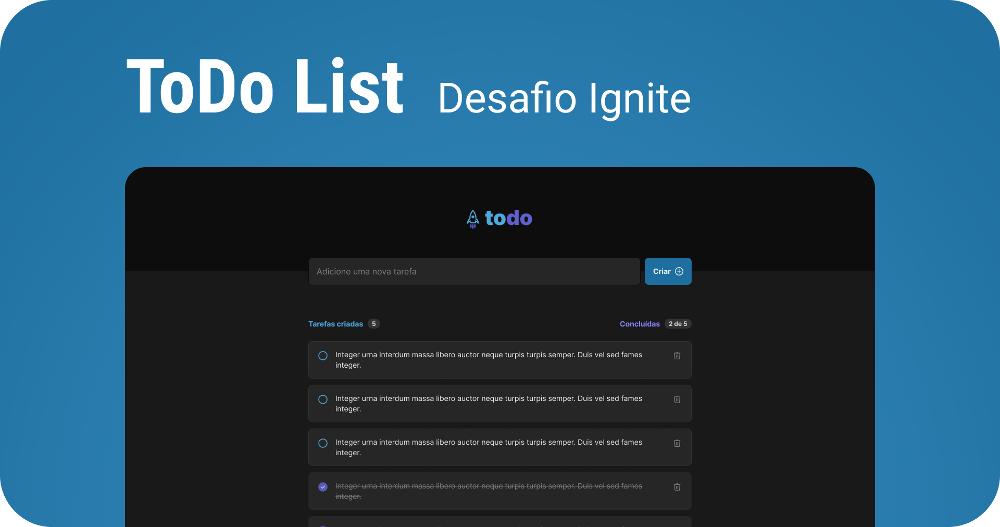

<p align="center">
  
    
</p>


<h1 align="center">
  Todo List App
</h1>
<p align="center">
  Challenge 1 - Learning about React Native Concepts
</p>


## 💻 About Project

Develop a **ToDo-List**, a task control application, which contains the following features: 

- Add a new task.
- Mark and clear a task as complete.
- Remove a task from the listing.
- Show progress on task completion.

I used this challenge to review my way on thinking in React, how to structure a (small) project like that... 
Decide where the states and functions should live, and more. 
I follow this excellent guide: [Thinking in React](https://beta.reactjs.org/learn/thinking-in-react).  


## 🔧 Technologies used

- [React](https://reactjs.org/)
- [TypeScript](https://www.typescriptlang.org/)
- [Vite](https://vitejs.dev/)
- [React-Icons](https://react-icons.github.io/react-icons/)
- [Sass](https://sass-lang.com/)
- [UUID](https://www.npmjs.com/package/uuid)


### See live [here](https://github.com/edu2andrade/todo-list-web).


## :octocat: How to test and install

Clone this repository:

```sh
git clone https://github.com/edu2andrade/todo-list-web.git
```

Install dependencies:

```sh
yarn
```

Start development environment:

```sh
yarn dev
```


## 📝 License

This project is under [MIT License](./LICENSE).


## 👽 Author

Made with 🤘 by [Eduardo Andrade](https://andradept.com/)
